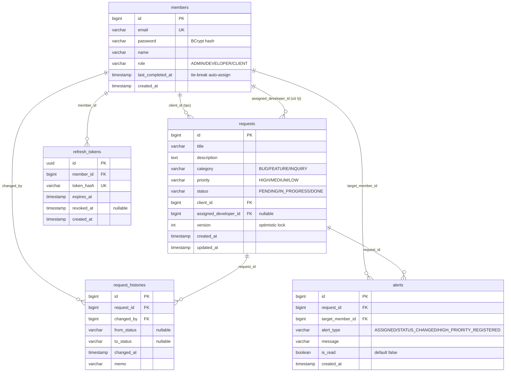

# ERD — Thiết kế Database

> Mô hình dữ liệu của **Bzcom CRM**, quan hệ giữa các bảng, và **lý do thiết kế** từng quyết định.
>
> Phục vụ **Slide 3 — ERD Design**. Rubric: *"quan hệ chuẩn hoá, giải thích rõ"* ↔ *"chỉ liệt kê field"*. → Tài liệu này nhấn mạnh **vì sao**, không chỉ **cái gì**.

---

## Mục lục
1. [Sơ đồ ERD (Mermaid)](#1-sơ-đồ-erd-mermaid)
2. [Chi tiết từng bảng](#2-chi-tiết-từng-bảng)
3. [Quan hệ & cardinality](#3-quan-hệ--cardinality)
4. [Quyết định thiết kế cần nhấn mạnh](#4-quyết-định-thiết-kế-cần-nhấn-mạnh)
5. [Index & ràng buộc](#5-index--ràng-buộc)
6. [File DBML (dán vào dbdiagram.io)](#6-file-dbml-dán-vào-dbdiagramio)
7. [Flyway migration (V1__init.sql)](#7-flyway-migration-v1__initsql)
8. [Seed data (V2__seed.sql)](#8-seed-data-v2__seedsql)

---

## 1. Sơ đồ ERD (Mermaid)

> Render trực tiếp trên GitHub. (Có thể vẽ lại đẹp hơn bằng dbdiagram.io từ DBML ở §6 để đưa lên slide.)



## 2. Chi tiết từng bảng

### `members` — người dùng hệ thống
| Cột | Kiểu | Ràng buộc | Ghi chú |
|---|---|---|---|
| id | bigint | PK, auto increment | |
| email | varchar(255) | UNIQUE, NOT NULL | login id |
| password | varchar(255) | NOT NULL | **BCrypt hash** — không bao giờ plaintext |
| name | varchar(100) | NOT NULL | |
| role | varchar(20) | NOT NULL | `ADMIN` / `DEVELOPER` / `CLIENT` |
| last_completed_at | timestamp | NULL | mốc hoàn thành gần nhất — **tie-break** auto-assign |
| created_at | timestamp | NOT NULL | JPA Auditing |

### `requests` — yêu cầu khách hàng
| Cột | Kiểu | Ràng buộc | Ghi chú |
|---|---|---|---|
| id | bigint | PK | |
| title | varchar(200) | NOT NULL | |
| description | text | | |
| category | varchar(20) | NOT NULL | `BUG` / `FEATURE` / `INQUIRY` |
| priority | varchar(20) | NOT NULL | `HIGH` / `MEDIUM` / `LOW` |
| status | varchar(20) | NOT NULL, default `PENDING` | vòng đời trạng thái |
| client_id | bigint | FK → members.id, NOT NULL | người tạo (CLIENT) |
| assigned_developer_id | bigint | FK → members.id, NULL | dev được gán (ban đầu null) |
| version | int | NOT NULL, default 0 | **optimistic lock** (`@Version`) |
| created_at | timestamp | NOT NULL | JPA Auditing |
| updated_at | timestamp | NOT NULL | JPA Auditing |

### `request_histories` — lịch sử thay đổi (bất biến, append-only)
| Cột | Kiểu | Ràng buộc | Ghi chú |
|---|---|---|---|
| id | bigint | PK | |
| request_id | bigint | FK → requests.id, NOT NULL | |
| changed_by | bigint | FK → members.id, NOT NULL | ai gây ra thay đổi |
| from_status | varchar(20) | NULL | null khi hành động là "gán" (status không đổi) |
| to_status | varchar(20) | NULL | null khi chỉ gán, không đổi status |
| changed_at | timestamp | NOT NULL | |
| memo | varchar(255) | | mô tả (vd "auto-assigned to Dev One") |

### `alerts` — thông báo
| Cột | Kiểu | Ràng buộc | Ghi chú |
|---|---|---|---|
| id | bigint | PK | |
| request_id | bigint | FK → requests.id, NOT NULL | request liên quan |
| target_member_id | bigint | FK → members.id, NOT NULL | người nhận |
| alert_type | varchar(30) | NOT NULL | `ASSIGNED` / `STATUS_CHANGED` / `HIGH_PRIORITY_REGISTERED` |
| message | varchar(255) | | nội dung hiển thị |
| is_read | boolean | NOT NULL, default false | |
| created_at | timestamp | NOT NULL | |

### `refresh_tokens` — phiên đăng nhập có thể thu hồi
| Cột | Kiểu | Ràng buộc | Ghi chú |
|---|---|---|---|
| id | uuid | PK | định danh phiên/token |
| member_id | bigint | FK → members.id, NOT NULL | chủ sở hữu token |
| token_hash | varchar(64) | UNIQUE, NOT NULL | SHA-256 của **opaque refresh token**; không lưu raw token. Revocation phải là update nguyên tử có điều kiện `revoked_at IS NULL`. |
| expires_at | timestamp | NOT NULL | thời điểm hết hạn refresh token |
| revoked_at | timestamp | NULL | có giá trị khi logout/rotation |
| created_at | timestamp | NOT NULL | audit phiên đăng nhập |

> Bảng này là phần mở rộng có chủ đích ngoài 4 bảng nghiệp vụ đề bài liệt kê. Nó giải quyết đúng semantics của `logout`: access token JWT vẫn stateless và ngắn hạn, còn refresh token được lưu bền vững để revoke/rotate. Không dùng bảng này để lưu access token.

## 3. Quan hệ & cardinality

| Quan hệ | Cardinality | Qua cột | Giải thích |
|---|---|---|---|
| members → requests (tạo) | 1 : N | `client_id` | Một CLIENT tạo nhiều request |
| members → requests (xử lý) | 1 : N | `assigned_developer_id` | Một DEVELOPER xử lý nhiều request |
| requests → request_histories | 1 : N | `request_id` | Mỗi request có nhiều mốc lịch sử |
| members → request_histories | 1 : N | `changed_by` | Một member gây ra nhiều thay đổi |
| requests → alerts | 1 : N | `request_id` | Một request sinh nhiều alert |
| members → alerts | 1 : N | `target_member_id` | Một member nhận nhiều alert |
| members → refresh_tokens | 1 : N | `member_id` | Một member có thể đăng nhập từ nhiều thiết bị/phiên |

> **Điểm nhấn khi trình bày (câu hỏi giám khảo hay hỏi):**
> *"Vì sao có **hai** quan hệ từ `members` tới `requests`?"* → Vì một request có **hai vai trò khác nhau** của member: người **tạo** (`client_id`) và người **xử lý** (`assigned_developer_id`). Đây là hai FK riêng biệt trỏ về cùng bảng — cần nêu rõ để không bị hiểu nhầm là quan hệ trùng.

## 4. Quyết định thiết kế cần nhấn mạnh

| Quyết định | Lý do (design intent) | Đánh đổi |
|---|---|---|
| **`currentTaskCount` KHÔNG lưu cột** — tính động bằng `COUNT(requests WHERE assigned_developer_id = ? AND status != DONE)` | Tránh **dữ liệu lệch** (denormalization risk): nếu lưu cột đếm, mỗi lần assign/complete phải nhớ cập nhật, dễ sai. | Thêm 1 query mỗi lần auto-assign (chấp nhận vì dữ liệu nhỏ) |
| **`last_completed_at` lưu ở members** | Chỉ dùng cho **tie-break** auto-assign (khi count bằng nhau, chọn người hoàn thành gần nhất) → cần một cột nhẹ thay vì query lịch sử. | Phải cập nhật cột này khi 1 request chuyển sang DONE |
| **`version` (optimistic lock)** | Chống 2 người đổi status cùng lúc ghi đè nhau (race condition). | Update xung đột → 1 bên nhận 409, phải thử lại |
| **`role`/`status`/`category`/`priority` lưu dạng `varchar` + `@Enumerated(STRING)`** | Đọc DB dễ hiểu (thấy `PENDING` thay vì số 0); an toàn khi thêm enum value. | Tốn chỗ hơn lưu số (không đáng kể) |
| **`request_histories` append-only** | Là **audit log** — không sửa/xoá, đảm bảo truy vết đầy đủ (giải quyết pain point P2). | Bảng lớn dần theo thời gian (không vấn đề cho demo) |
| **`from_status`/`to_status` nullable** | Hành động "gán developer" không đổi status → 2 cột này để null, phân biệt với hành động "đổi status". | Cần hiểu quy ước khi đọc history |
| **Chuẩn hoá 3NF** | Không lặp dữ liệu member trong request/alert; chỉ lưu FK. | Cần JOIN khi hiển thị tên (chấp nhận) |
| **Refresh token opaque + hash** | Có thể logout, revoke và rotation mà không lưu raw credential trong DB; JWT access token vẫn nhẹ và stateless. | Thêm một bảng auth, access token đã phát hành vẫn sống đến lúc hết hạn ngắn |

## 5. Index & ràng buộc

**Index (tối ưu truy vấn hay dùng):**
```sql
CREATE INDEX idx_requests_status              ON requests(status);
CREATE INDEX idx_requests_assigned_developer  ON requests(assigned_developer_id);
CREATE INDEX idx_requests_client              ON requests(client_id);
CREATE INDEX idx_histories_request            ON request_histories(request_id);
CREATE INDEX idx_alerts_target                ON alerts(target_member_id);
CREATE INDEX idx_alerts_is_read               ON alerts(is_read);
CREATE INDEX idx_refresh_tokens_member_active ON refresh_tokens(member_id, expires_at) WHERE revoked_at IS NULL;
```
Lý do: filter request theo status/role, auto-assign đếm theo developer, lấy history theo request, lấy alert của 1 người (đọc/chưa đọc) — đều là các truy vấn nóng.

**Ràng buộc toàn vẹn:** mọi FK có `ON DELETE RESTRICT` (không cho xoá member/request còn được tham chiếu) — bảo vệ audit trail.

## 6. File DBML (dán vào dbdiagram.io)

```dbml
Table members {
  id bigint [pk, increment]
  email varchar [unique, not null]
  password varchar [not null, note: 'BCrypt hash']
  name varchar [not null]
  role varchar [not null, note: 'ADMIN / DEVELOPER / CLIENT']
  last_completed_at timestamp [note: 'tie-break auto-assign']
  created_at timestamp [not null]
}

Table requests {
  id bigint [pk, increment]
  title varchar [not null]
  description text
  category varchar [not null, note: 'BUG / FEATURE / INQUIRY']
  priority varchar [not null, note: 'HIGH / MEDIUM / LOW']
  status varchar [not null, default: 'PENDING', note: 'PENDING / IN_PROGRESS / DONE']
  client_id bigint [not null, ref: > members.id]
  assigned_developer_id bigint [ref: > members.id]
  version int [not null, default: 0, note: 'optimistic lock']
  created_at timestamp [not null]
  updated_at timestamp [not null]
}

Table request_histories {
  id bigint [pk, increment]
  request_id bigint [not null, ref: > requests.id]
  changed_by bigint [not null, ref: > members.id]
  from_status varchar
  to_status varchar
  changed_at timestamp [not null]
  memo varchar
}

Table alerts {
  id bigint [pk, increment]
  request_id bigint [not null, ref: > requests.id]
  target_member_id bigint [not null, ref: > members.id]
  alert_type varchar [not null, note: 'ASSIGNED / STATUS_CHANGED / HIGH_PRIORITY_REGISTERED']
  message varchar
  is_read boolean [not null, default: false]
  created_at timestamp [not null]
}

Table refresh_tokens {
  id uuid [pk]
  member_id bigint [not null, ref: > members.id]
  token_hash varchar [not null, unique, note: 'SHA-256 hash of opaque refresh token']
  expires_at timestamp [not null]
  revoked_at timestamp
  created_at timestamp [not null]
}
```

## 7. Flyway migration (V1__init.sql)

> Đặt tại `src/main/resources/db/migration/V1__init.sql`. Flyway chạy tự động lúc app start.

```sql
CREATE TABLE members (
    id                 BIGSERIAL PRIMARY KEY,
    email              VARCHAR(255) NOT NULL UNIQUE,
    password           VARCHAR(255) NOT NULL,
    name               VARCHAR(100) NOT NULL,
    role               VARCHAR(20)  NOT NULL,
    last_completed_at  TIMESTAMP,
    created_at         TIMESTAMP    NOT NULL DEFAULT now(),
    CONSTRAINT chk_members_role CHECK (role IN ('ADMIN', 'DEVELOPER', 'CLIENT'))
);

CREATE TABLE requests (
    id                     BIGSERIAL PRIMARY KEY,
    title                  VARCHAR(200) NOT NULL,
    description            TEXT,
    category               VARCHAR(20)  NOT NULL,
    priority               VARCHAR(20)  NOT NULL,
    status                 VARCHAR(20)  NOT NULL DEFAULT 'PENDING',
    client_id              BIGINT       NOT NULL REFERENCES members(id) ON DELETE RESTRICT,
    assigned_developer_id  BIGINT       REFERENCES members(id) ON DELETE RESTRICT,
    version                INT          NOT NULL DEFAULT 0,
    created_at             TIMESTAMP    NOT NULL DEFAULT now(),
    updated_at             TIMESTAMP    NOT NULL DEFAULT now(),
    CONSTRAINT chk_requests_category CHECK (category IN ('BUG', 'FEATURE', 'INQUIRY')),
    CONSTRAINT chk_requests_priority CHECK (priority IN ('HIGH', 'MEDIUM', 'LOW')),
    CONSTRAINT chk_requests_status CHECK (status IN ('PENDING', 'IN_PROGRESS', 'DONE'))
);

CREATE TABLE request_histories (
    id           BIGSERIAL PRIMARY KEY,
    request_id   BIGINT      NOT NULL REFERENCES requests(id) ON DELETE RESTRICT,
    changed_by   BIGINT      NOT NULL REFERENCES members(id) ON DELETE RESTRICT,
    from_status  VARCHAR(20),
    to_status    VARCHAR(20),
    changed_at   TIMESTAMP   NOT NULL DEFAULT now(),
    memo         VARCHAR(255)
);

CREATE TABLE alerts (
    id                BIGSERIAL PRIMARY KEY,
    request_id        BIGINT      NOT NULL REFERENCES requests(id) ON DELETE RESTRICT,
    target_member_id  BIGINT      NOT NULL REFERENCES members(id) ON DELETE RESTRICT,
    alert_type        VARCHAR(30) NOT NULL,
    message           VARCHAR(255),
    is_read           BOOLEAN     NOT NULL DEFAULT false,
    created_at        TIMESTAMP   NOT NULL DEFAULT now(),
    CONSTRAINT chk_alerts_type CHECK (alert_type IN ('ASSIGNED', 'STATUS_CHANGED', 'HIGH_PRIORITY_REGISTERED'))
);

CREATE TABLE refresh_tokens (
    id          UUID         PRIMARY KEY,
    member_id   BIGINT       NOT NULL REFERENCES members(id) ON DELETE RESTRICT,
    token_hash  VARCHAR(64)  NOT NULL UNIQUE,
    expires_at  TIMESTAMP    NOT NULL,
    revoked_at  TIMESTAMP,
    created_at  TIMESTAMP    NOT NULL DEFAULT now(),
    CONSTRAINT chk_refresh_expiry CHECK (expires_at > created_at)
);

CREATE INDEX idx_requests_status             ON requests(status);
CREATE INDEX idx_requests_assigned_developer ON requests(assigned_developer_id);
CREATE INDEX idx_requests_client             ON requests(client_id);
CREATE INDEX idx_histories_request           ON request_histories(request_id);
CREATE INDEX idx_alerts_target               ON alerts(target_member_id);
CREATE INDEX idx_alerts_is_read              ON alerts(is_read);
CREATE INDEX idx_refresh_tokens_member_active
    ON refresh_tokens(member_id, expires_at) WHERE revoked_at IS NULL;
```

## 8. Seed data (V2__seed.sql)

> Password seed đều là BCrypt hash hợp lệ của `1234` (cost 10), chỉ dùng cho demo. Seed giúp demo filter/stats/auto-assign có dữ liệu ngay.

```sql
-- Password của mọi tài khoản là '1234'. Hash BCrypt thật (cost=10), chỉ dùng cho demo.
INSERT INTO members (email, name, role, password, created_at) VALUES
 ('admin@bzcom.com',   'Admin',   'ADMIN',     '$2y$10$9FEnUY37Ok54UtidIbFlyOyNct/GMaF9dG1.GtIemnW6vWTPyfnGW', now()),
 ('dev1@bzcom.com',    'Dev One', 'DEVELOPER', '$2y$10$9FEnUY37Ok54UtidIbFlyOyNct/GMaF9dG1.GtIemnW6vWTPyfnGW', now()),
 ('dev2@bzcom.com',    'Dev Two', 'DEVELOPER', '$2y$10$9FEnUY37Ok54UtidIbFlyOyNct/GMaF9dG1.GtIemnW6vWTPyfnGW', now()),
 ('client1@bzcom.com', 'Client One','CLIENT',  '$2y$10$9FEnUY37Ok54UtidIbFlyOyNct/GMaF9dG1.GtIemnW6vWTPyfnGW', now());

-- vài request mẫu để demo filter & statistics
INSERT INTO requests (title, description, category, priority, status, client_id, created_at, updated_at) VALUES
 ('Login fails',        'Click login shows 500', 'BUG',     'HIGH',   'PENDING', 4, now(), now()),
 ('Add Google login',   'SSO with Google',       'FEATURE', 'MEDIUM', 'PENDING', 4, now(), now()),
 ('How to reset pass?', 'Cannot find the button','INQUIRY', 'LOW',    'PENDING', 4, now(), now());
```

> **Reset để demo lại sạch:** `docker compose down -v && docker compose up` (xoá volume → Flyway chạy lại từ đầu). Hoặc cung cấp endpoint `POST /api/admin/reset-demo` (chỉ profile demo).

---

*Model dữ liệu này là nền cho [BUSINESS_LOGIC.md](./BUSINESS_LOGIC.md) (dùng các bảng ra sao) và [openapi.yaml](./openapi.yaml) (schema DTO map từ entity). PostgreSQL 16 là database chuẩn cho mọi integration test; không dùng H2 để tránh sai khác dialect/migration.*
